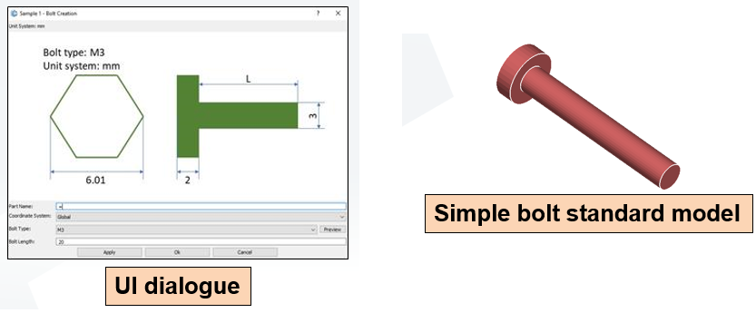
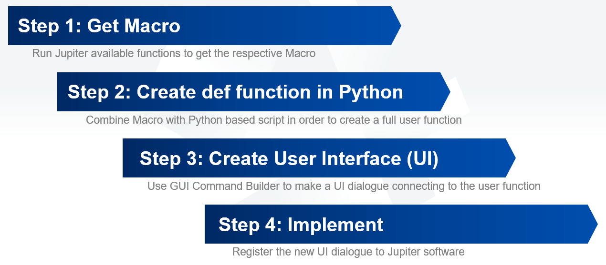

## Purpose and Target
The purpose of this user function: is to create a custom bolt according to user standard.

The target of this tutorial: generate a UI dialogue supporting user create a simple bolt standard model with just some inputs and selections.



## Work Flow



## Sample Code

CreateBolt.py

```python
import os
import re
from os import listdir
from os.path import isfile, join

# Set the size for the bolt
def get_bolt_size(get_param_bolt_type):
    """ Bolt type for standard size"""
    if get_param_bolt_type == 0: # M3
        return [2e-3, 6.01e-3, 3e-3]
    elif get_param_bolt_type == 1: # M4
        return [2.8e-3, 7.66e-3, 4e-3]
    elif get_param_bolt_type == 2: # M5
        return [3.5e-3, 8.79e-3, 5e-3]
    elif get_param_bolt_type == 3: # M6
        return [4e-3, 11.5e-3, 6e-3]
    elif get_param_bolt_type == 4: # M8
        return [5.3e-3, 14.38e-3, 8e-3]
    elif get_param_bolt_type == 5: # M10
        return [6.4e-3, 18.9e-3, 10e-3]
    elif get_param_bolt_type == 6: # M12
        return [7.5e-3, 21.1e-3, 12e-3]
    elif get_param_bolt_type == 7: # M14
        return [8.8e-3, 24.49e-3, 14e-3]
    elif get_param_bolt_type == 8: # M16
        return [10-3, 26.75e-3, 16e-3]
    elif get_param_bolt_type == 9: # M18
        return [11.5e-3, 30.14e-3, 18e-3]
    elif get_param_bolt_type == 10: # M20
        return [12.5e-3, 33.53e-3, 20e-3]
    elif get_param_bolt_type == 11: # M22
        return [14e-3, 35.72e-3, 22e-3]
    elif get_param_bolt_type == 12: # M24
        return [15e-3, 39.98e-3, 24e-3]
    elif get_param_bolt_type == 13: # M27
        return [17e-3, 45.2e-3, 27e-3]
    elif get_param_bolt_type == 14: # M30
        return [18.7e-3, 50.85e-3, 30e-3]
    else:
        print("error")

def replace_str(err, instr):
    modstr = instr
    for i in range (len(err)):
        modstr = modstr.replace(str(err[i]), " ")
    modstr = re.sub("\s+", " ", modstr).strip().split(" ")
    return modstr

def change_bolt_pic(dlg):
    """ Change the picture of the select bolt """
    path = "C:/Users/Mogami/Desktop/CreatingBolt_Pics/"
    onlyfiles = [f for f in listdir(path) if isfile(join(path, f))]
    for i in onlyfiles:
        filename, file_extension = i.split('.')
        if dlg.get_item_text('bolt_type') == filename:
            fullpath = path + i
            dlg.set_image_file('ImageCtrl', fullpath)
    
def on_execute_button_clicked(dlg, part_name, coord_system, bolt_type, bolt_length):
    [k, e, d] = get_bolt_size(bolt_type)
    nut_radius = e/2
    thread_radius = d/2
    cylinder_height = k
    cylinder_position = cylinder_height
    if coord_system == 0:
        coord_system = None
    get_param_bolt_length = float(bolt_length)*0.001
    Geometry.Part.Cylinder(strName=part_name, topRadius=nut_radius, botRadius=nut_radius, height=cylinder_height)
    Geometry.Part.Cylinder(strName=part_name, crCoord=coord_system, origin=[0.000, cylinder_position, 0.000], topRadius=thread_radius, botRadius=thread_radius, height=get_param_bolt_length)
    all_part = sorted([a.id for a in JPT.GetAllParts()], reverse = False)
    a = JPT.Exec('AssembleFaceMatingStep([], [], [3:{0}, 3:{1}], 0.0003).'.format(all_part[-2], all_part[-1]))
    errstr = ", []-\""
    JPT.Exec('AssembleFaceEx([{0}, {1}], 0.0003, 0, 0)'.format(replace_str(errstr, a)[-2], replace_str(errstr, a)[-1]))
    Geometry.MergeEntities.Parts(tolerance=1e-05, partCursor=[Part(all_part[-2], all_part[-1])])
    JPT.Exec('View Fit To Model()')
    new_name = dlg.get_item_text("part_name").split("_")[0].strip() + "_" + str(int(dlg.get_item_text("part_name").split("_")[-1].strip()) + 1)
    dlg.set_item_text("part_name", new_name)
```

CreateBolt_GUI.py

```python
from pyjdg import *
def main():
    dlg=JDGCreator(title="Sample 1 - Bolt Creation",resizable=True,validation=True)
    dlg.add_vlayout(name="Layout3",layout="Window")
    dlg.add_label(name="Label1",text="Unit System: mm",layout="Layout3")
    dlg.add_imagectrl(name="ImageCtrl",image_file="C:/Users/Mogami/Desktop/CreatingBolt_Pics/M3.JPG",layout="Layout3")
    dlg.add_hlayout(name="Layout2",layout="Layout3")
    dlg.add_label(name="Label3",text="Part Name:",width=100,layout="Layout2")
    dlg.add_textbox(name="part_name",text="Bolt_1",layout="Layout2")
    dlg.add_hlayout(name="Layout5",layout="Layout3")
    dlg.add_label(name="Label6",text="Coordinate System:",width=100,layout="Layout5")
    dlg.add_combobox(name="coord_system",options=["Global"],layout="Layout5")
    dlg.add_hlayout(name="Layout8",layout="Layout3")
    dlg.add_label(name="Label9",text="Bolt Type:",width=100,layout="Layout8")
    dlg.add_combobox(name="bolt_type",options=["M3","M4","M5","M6","M8","M10","M12","M14","M16","M18","M20","M22","M24","M27","M30"],width=80,layout="Layout8")
    dlg.add_button(name="update_picture",text="Preview",width=60,height=18,layout="Layout8")
    dlg.add_hlayout(name="Layout11",layout="Layout3")
    dlg.add_label(name="Label12",text="Bolt Length:",width=100,layout="Layout11")
    dlg.add_textbox(name="bolt_length",text="20",layout="Layout11")
    dlg.add_hlayout(name="footer",layout="Window")
    dlg.add_space(orientation="horizontal",layout="footer")
    dlg.add_button(name="ButtonApply",text="Apply",layout="footer")
    dlg.add_button(name="ButtonOk",text="Ok",layout="footer")
    dlg.add_button(name="ButtonCancel",text="Cancel",layout="footer")
    dlg.add_space(orientation="horizontal",layout="footer")
    dlg.generate_window()
if __name__=='__main__':
    main()
```

CreateBolt_PSJ.py

```python
import os
import re
from os import listdir
from os.path import isfile, join

# Set the size for the bolt
def get_bolt_size(get_param_bolt_type):
    """ Bolt type for standard size"""
    if get_param_bolt_type == 0: # M3
        return [2e-3, 6.01e-3, 3e-3]
    elif get_param_bolt_type == 1: # M4
        return [2.8e-3, 7.66e-3, 4e-3]
    elif get_param_bolt_type == 2: # M5
        return [3.5e-3, 8.79e-3, 5e-3]
    elif get_param_bolt_type == 3: # M6
        return [4e-3, 11.5e-3, 6e-3]
    elif get_param_bolt_type == 4: # M8
        return [5.3e-3, 14.38e-3, 8e-3]
    elif get_param_bolt_type == 5: # M10
        return [6.4e-3, 18.9e-3, 10e-3]
    elif get_param_bolt_type == 6: # M12
        return [7.5e-3, 21.1e-3, 12e-3]
    elif get_param_bolt_type == 7: # M14
        return [8.8e-3, 24.49e-3, 14e-3]
    elif get_param_bolt_type == 8: # M16
        return [10-3, 26.75e-3, 16e-3]
    elif get_param_bolt_type == 9: # M18
        return [11.5e-3, 30.14e-3, 18e-3]
    elif get_param_bolt_type == 10: # M20
        return [12.5e-3, 33.53e-3, 20e-3]
    elif get_param_bolt_type == 11: # M22
        return [14e-3, 35.72e-3, 22e-3]
    elif get_param_bolt_type == 12: # M24
        return [15e-3, 39.98e-3, 24e-3]
    elif get_param_bolt_type == 13: # M27
        return [17e-3, 45.2e-3, 27e-3]
    elif get_param_bolt_type == 14: # M30
        return [18.7e-3, 50.85e-3, 30e-3]
    else:
        print("error")

def replace_str(err, instr):
    modstr = instr
    for i in range (len(err)):
        modstr = modstr.replace(str(err[i]), " ")
    modstr = re.sub("\s+", " ", modstr).strip().split(" ")
    return modstr

def change_bolt_pic(dlg):
    """ Change the picture of the select bolt """
    path = "C:/Users/Mogami/Desktop/CreatingBolt_Pics/"
    onlyfiles = [f for f in listdir(path) if isfile(join(path, f))]
    for i in onlyfiles:
        filename, file_extension = i.split('.')
        if dlg.get_item_text('bolt_type') == filename:
            fullpath = path + i
            dlg.set_image_file('ImageCtrl', fullpath)
    
def on_execute_button_clicked(dlg, part_name, coord_system, bolt_type, bolt_length):
    [k, e, d] = get_bolt_size(bolt_type)
    nut_radius = e/2
    thread_radius = d/2
    cylinder_height = k
    cylinder_position = cylinder_height
    if coord_system == 0:
        coord_system = None
    get_param_bolt_length = float(bolt_length)*0.001
    Geometry.Part.Cylinder(strName=part_name, topRadius=nut_radius, botRadius=nut_radius, height=cylinder_height)
    Geometry.Part.Cylinder(strName=part_name, crCoord=coord_system, origin=[0.000, cylinder_position, 0.000], topRadius=thread_radius, botRadius=thread_radius, height=get_param_bolt_length)
    all_part = sorted([a.id for a in JPT.GetAllParts()], reverse = False)
    a = JPT.Exec('AssembleFaceMatingStep([], [], [3:{0}, 3:{1}], 0.0003).'.format(all_part[-2], all_part[-1]))
    errstr = ", []-\""
    JPT.Exec('AssembleFaceEx([{0}, {1}], 0.0003, 0, 0)'.format(replace_str(errstr, a)[-2], replace_str(errstr, a)[-1]))
    Geometry.MergeEntities.Parts(tolerance=1e-05, partCursor=[Part(all_part[-2], all_part[-1])])
    JPT.Exec('View Fit To Model()')
    new_name = dlg.get_item_text("part_name").split("_")[0].strip() + "_" + str(int(dlg.get_item_text("part_name").split("_")[-1].strip()) + 1)
    dlg.set_item_text("part_name", new_name)

from pyjdg import *
def main():
    """ Create JDB from JDG """
    dlg=JDGCreator(title="Sample 1 - Bolt Creation",resizable=True,validation=True)
    dlg.add_vlayout(name="Layout3",layout="Window")
    dlg.add_label(name="Label1",text="Unit System: mm",layout="Layout3")
    dlg.add_imagectrl(name="ImageCtrl",image_file="C:/Users/Mogami/Desktop/CreatingBolt_Pics/M3.JPG",layout="Layout3")
    dlg.add_hlayout(name="Layout2",layout="Layout3")
    dlg.add_label(name="Label3",text="Part Name:",width=100,layout="Layout2")
    dlg.add_textbox(name="part_name",text="Bolt_1",layout="Layout2")
    dlg.add_hlayout(name="Layout5",layout="Layout3")
    dlg.add_label(name="Label6",text="Coordinate System:",width=100,layout="Layout5")
    dlg.add_combobox(name="coord_system",options=["Global"],layout="Layout5")
    dlg.add_hlayout(name="Layout8",layout="Layout3")
    dlg.add_label(name="Label9",text="Bolt Type:",width=100,layout="Layout8")
    dlg.add_combobox(name="bolt_type",options=["M3","M4","M5","M6","M8","M10","M12","M14","M16","M18","M20","M22","M24","M27","M30"],width=80,layout="Layout8")
    dlg.add_button(name="update_picture",text="Preview",width=60,height=22,layout="Layout8")
    dlg.add_hlayout(name="Layout11",layout="Layout3")
    dlg.add_label(name="Label12",text="Bolt Length:",width=100,layout="Layout11")
    dlg.add_textbox(name="bolt_length",text="20",layout="Layout11")
    dlg.add_hlayout(name="footer",layout="Window")
    dlg.add_space(orientation="horizontal",layout="footer")
    dlg.add_button(name="ButtonApply",text="Apply",layout="footer")
    dlg.add_button(name="ButtonOk",text="Ok",layout="footer")
    dlg.add_button(name="ButtonCancel",text="Cancel",layout="footer")
    dlg.add_space(orientation="horizontal",layout="footer")
    dlg.on_command("ButtonApply",on_execute_button_clicked)
    dlg.on_command("ButtonOk",on_execute_button_clicked)
    dlg.on_command("update_picture", change_bolt_pic)
    dlg.generate_window()
if __name__=='__main__':
    main()
```